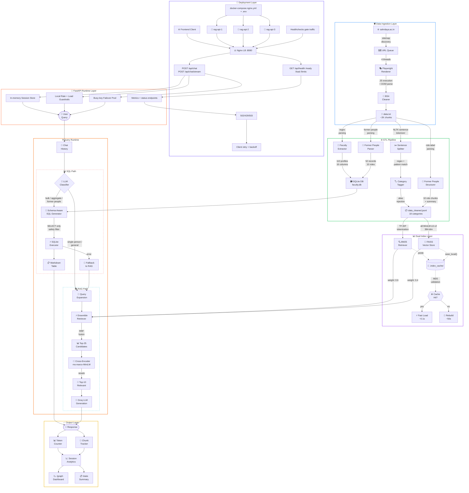

# Sahrdaya RAG X — College Chatbot Backend

A Retrieval-Augmented Generation (RAG) chatbot backend for **Sahrdaya College of Engineering & Technology (SCET)**, Kodakara, Thrissur, Kerala. It answers questions about faculty, departments, admissions, placements, clubs, infrastructure, and more — all grounded in data scraped from the college website.

> **📚 Want to learn how it works?** Check [WORKING.md](WORKING.md) for a complete technical breakdown of the RAG pipeline: scraping, preprocessing, hybrid retrieval (BM25 + Vector), SQL routing, index caching, and answer generation.
>
> **🚀 What's planned next?** See [FUTURE_ADDITIONS.md](FUTURE_ADDITIONS.md) for the roadmap: streaming responses, Docker, web frontend, and more.
>
> **🧩 Connecting a frontend?** See [FRONTEND_INTEGRATION.md](FRONTEND_INTEGRATION.md) for API payloads, session flow, streaming examples, and frontend integration patterns.

## Quick Run

```bash
git clone <repo-url>
cd ragx-backend
pip install -r requirements.txt
```

Copy environment template and add your Groq key(s):

```bash
copy .env.example .env
```

Then start API server:

```bash
python api_main.py
```

Or start the load-balanced Docker stack:

```bash
docker compose -f docker-compose.nginx.yml up --build -d
```

## Full Architecture

### Combined RAG + API + Deployment Architecture



| File | Role |
|---|---|
| `scraper.py` | Multi-threaded web scraper (Playwright + Sitemap, thread-safe, 4 output formats) |
| `data.txt` | Raw scraped chunks (TSV: `chunk_id\tcontent`) |
| `preprocess_data.py` | Cleans, categorises (18 categories), sentence-splits, injects search aliases, and structures former people data |
| `data_cleaned.jsonl` | Optimised chunks ready for indexing |
| `faculty_db.py` | Parses faculty profiles from raw data, builds SQLite database (110 records, 16 columns) |
| `faculty.db` | SQLite faculty database (auto-generated) |
| `rag_setup.py` | Builds FAISS + BM25 indexes (with cache), SQL classifier, LLM chain, hybrid retrieval |
| `main.py` | Interactive CLI chatbot with stats, ASCII dashboard, and session analytics |
| `api/` | FastAPI app split into `core`, `routes`, and `services` layers |
| `api_main.py` | API entrypoint (Uvicorn) |
| `.env` / `.env.example` | Runtime settings (keys, limits, CORS, concurrency) |
| `Dockerfile` | Container image for API service |
| `docker-compose.yml` | Single-container deployment |
| `docker-compose.nginx.yml` | 3 API containers + Nginx load balancing |
| `deploy/nginx-docker.conf` | Nginx upstream/load-balancer config for Docker |

## Prerequisites

- **Python 3.10+** (tested on 3.14)
- A **Groq API key** set via `.env` (`GROQ_API_KEY` or `GROQ_API_KEYS`)
- ~500 MB disk space for embeddings model download on first run
- **Playwright** browsers (only needed for scraping): `playwright install`

## Setup

### 1. Clone the repo

```bash
git clone <repo-url>
cd ragx-backend
```

### 2. Create a virtual environment (recommended)

```bash
python -m venv venv
# Windows
venv\Scripts\activate
# Linux / macOS
source venv/bin/activate
```

### 3. Install dependencies

```bash
pip install -r requirements.txt
```

Key packages: `langchain`, `langchain-community`, `langchain-classic`, `langchain-groq`, `langchain-huggingface`, `faiss-cpu`, `rank-bm25`, `nltk`, `groq`, `beautifulsoup4`, `playwright`.

### 4. Download NLTK data (auto-handled, but can be done manually)

```python
import nltk
nltk.download("punkt_tab")
```

## Usage

### Step 1 — Scrape (only if you need fresh data)

```bash
# Full site crawl
python scraper.py https://www.sahrdaya.ac.in/ -o sahrdaya --threads 8 --use-playwright

# Single page append
python scraper.py https://www.sahrdaya.ac.in/faculty -o sahrdaya --single --use-playwright
```

This produces `sahrdaya_rag.txt`. Rename/copy it to `data.txt`:

```bash
copy sahrdaya_rag.txt data.txt
```

### Step 2 — Preprocess

```bash
python preprocess_data.py
```

Reads `data.txt`, cleans text, detects categories, splits into sentence-aware chunks, injects search aliases, structures former people data into per-role chunks, and writes `data_cleaned.jsonl`.

Sample output:
```
[1/4] Loaded 785 raw chunks from data.txt
[2/4] Cleaned text — kept 784 chunks, skipped 1 near-empty
[3/4] Categorised & re-chunked — 2198 final chunks (466 large chunks were split)
[4/4] Wrote 2198 chunks to data_cleaned.jsonl
```

### Step 3 — Run the chatbot

```bash
python main.py
```

On first run, FAISS and BM25 indexes are built from `data_cleaned.jsonl` (~50s). Subsequent runs load from `.index_cache/` in ~0.1s. The cache auto-invalidates when the data file changes (MD5 hash check).

If `faculty.db` doesn't exist, it's auto-built from `data.txt` on startup.

### Step 4 — Run the FastAPI chatbot server

Copy environment template and add your keys:

```bash
copy .env.example .env
```

Then start API server:

```bash
python api_main.py
```

API endpoints:

| Endpoint | Method | Purpose |
|---|---|---|
| `/api/chat` | POST | Chat request-response API |
| `/api/chat/stream` | POST | SSE streaming events |
| `/api/sessions` | POST | Create new chat session |
| `/api/sessions/{session_id}/history` | GET | Get session chat history |
| `/api/sessions/{session_id}` | DELETE | Delete session |
| `/api/health` | GET | Liveness check |
| `/api/ready` | GET | Readiness check |
| `/api/load` | GET | Current in-flight load |
| `/api/limits` | GET | Local quota usage + key health |

The API includes:
- in-memory session isolation
- busy-key failover (switch to next key if one key is rate-limited)
- local quota guardrails for RPM/TPM/RPD/TPD
- full-answer policy (no API-side output truncation; continuation attempts if model stops due length)

### Step 5 — Run with Docker (recommended for different computers)

#### Option A: Single API container

```bash
docker compose up --build -d
```

Access API at:

```text
http://127.0.0.1:8000
```

Useful commands:

```bash
docker compose logs -f rag-api
docker compose down
```

#### Option B: Nginx + 3 API containers (local load balancing)

```bash
docker compose -f docker-compose.nginx.yml up --build -d
```

Access API through Nginx at:

```text
http://127.0.0.1:8080
```

Useful commands:

```bash
docker compose -f docker-compose.nginx.yml logs -f
docker compose -f docker-compose.nginx.yml down
```

Docker files added:
- `Dockerfile`
- `.dockerignore`
- `docker-compose.yml`
- `docker-compose.nginx.yml`
- `deploy/nginx-docker.conf`

## CLI Commands

| Command | Description |
|---|---|
| `/help` | Show available commands |
| `/graph` | Session dashboard with ASCII charts (response times, token usage, chunk heatmap) |
| `/chunks` | Show chunks used in last retrieval |
| `/history` | Show conversation history |
| `/stats` | Re-show last query stats box |
| `/clear` | Clear conversation history |
| `/reset` | Reset session stats and history |
| `exit` | Quit the program |

## Project Structure

```
ragx-backend/
├── scraper.py              # Web scraper (multi-threaded, Playwright)
├── data.txt                # Raw scraped data
├── preprocess_data.py      # Data preprocessing pipeline
├── data_cleaned.jsonl      # Processed chunks (generated)
├── faculty_db.py           # Faculty data parser → SQLite DB builder
├── faculty.db              # SQLite faculty database (auto-generated)
├── rag_setup.py            # RAG engine (indexes, chains, SQL classifier)
├── main.py                 # CLI chatbot with session analytics
├── api/
│   ├── app.py              # FastAPI app bootstrap + middleware wiring
│   ├── core/
│   │   ├── models.py       # Pydantic request/response schemas
│   │   └── settings.py     # Environment-backed configuration
│   ├── routes/
│   │   └── chat.py         # API endpoints (/api/chat, sessions, health)
│   └── services/
│       ├── key_pool.py     # Busy-key failover state
│       ├── load_control.py # Concurrency and queue controls
│       ├── rate_limit_manager.py # Local RPM/TPM/RPD/TPD budget tracking
│       └── session_store.py # In-memory session memory with TTL
├── api_main.py             # Uvicorn run entrypoint
├── .env.example            # Environment template
├── Dockerfile              # Docker image build
├── docker-compose.yml      # Single API deployment
├── docker-compose.nginx.yml # Nginx + 3 API replicas
├── deploy/
│   ├── nginx.conf          # Bare-metal/local nginx config
│   └── nginx-docker.conf   # Docker nginx config
├── FRONTEND_INTEGRATION.md # Frontend integration guide
├── tests/
│   └── test_api.py         # API tests
├── requirements.txt        # Python dependencies
├── .index_cache/           # Cached FAISS + BM25 indexes (auto-generated)
│   ├── faiss/              # FAISS vector index
│   ├── bm25.pkl            # BM25 retriever (k=8)
│   ├── bm25_large.pkl      # BM25 retriever (k=50)
│   └── data_hash.txt       # MD5 hash for cache invalidation
├── README.md               # Setup and usage guide
├── WORKING.md              # Technical documentation — how the RAG works
└── FUTURE_ADDITIONS.md     # Roadmap and planned improvements
```

## Configuration

| Setting | Default | File | Notes |
|---|---|---|---|
| LLM | Groq `openai/gpt-oss-120b` | `rag_setup.py` | Requires Groq API key |
| Embeddings | `all-MiniLM-L6-v2` (384-dim) | `rag_setup.py` | Runs locally, no API key |
| Chunk size | 700 chars target, 910 split threshold | `preprocess_data.py` | Sentence-aware splitting |
| Former people | 10 role-based chunks + 1 summary | `preprocess_data.py` | Structured per-role parsing for accurate retrieval |
| BM25:Vector weights | 0.6:0.4 | `rag_setup.py` | BM25 weighted higher for keyword queries |
| Max context | 22,000 chars (~6K tokens) | `rag_setup.py` | Truncates retrieved chunks to fit |
| SQL history limit | 1,500 chars | `rag_setup.py` | Caps history sent to SQL classifier |
| API host/port | `0.0.0.0:8000` | `.env` | Controlled by `API_HOST`, `API_PORT` |
| API concurrency | `4` | `.env` | `MAX_CONCURRENT_REQUESTS` for load control |
| Queue wait timeout | `20s` | `.env` | `QUEUE_WAIT_SECONDS` before busy response |
| Key failover | Enabled | `.env` + `api/services/key_pool.py` | Uses `GROQ_API_KEYS` pool with cooldown |
| Local quota guardrails | RPM/TPM/RPD/TPD | `.env` + `api/services/rate_limit_manager.py` | Protects service before upstream limits |

## License

This repository is **All Rights Reserved**.

- You may contribute to this repository through pull requests and approved collaboration workflows.
- You may not copy, reuse, redistribute, relicense, or sell this code outside this repository without prior written permission from the copyright holder.

See `LICENSE` for full legal terms.
