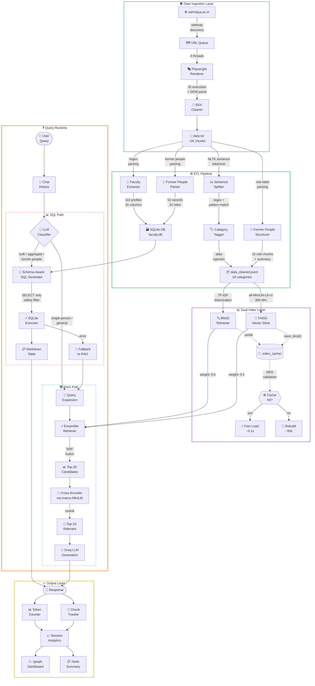

# Sahrdaya RAG X — College Chatbot Backend

A Retrieval-Augmented Generation (RAG) chatbot backend for **Sahrdaya College of Engineering & Technology (SCET)**, Kodakara, Thrissur, Kerala. It answers questions about faculty, departments, admissions, placements, clubs, infrastructure, and more — all grounded in data scraped from the college website.

> **📚 Want to learn how it works?** Check [WORKING.md](WORKING.md) for a complete technical breakdown of the RAG pipeline: scraping, preprocessing, hybrid retrieval (BM25 + Vector), SQL routing, index caching, and answer generation.
>
> **🚀 What's planned next?** See [FUTURE_ADDITIONS.md](FUTURE_ADDITIONS.md) for the roadmap: streaming responses, Docker, web frontend, and more.

## Quick Run

```bash
git clone <repo-url>
cd ragx-backend
pip install -r requirements.txt
```

Add your Groq API key in `rag_setup.py` (line ~169, `groq_api_key="..."`) and `scraper.py` (line ~50, `GROQ_API_KEY`), then:

```bash
python main.py
```

## Full Architecture



| File | Role |
|---|---|
| `scraper.py` | Multi-threaded web scraper (Playwright + Sitemap, thread-safe, 4 output formats) |
| `data.txt` | Raw scraped chunks (TSV: `chunk_id\tcontent`) |
| `preprocess_data.py` | Cleans, categorises (18 categories), sentence-splits, injects search aliases, and structures former people data |
| `data_cleaned.jsonl` | Optimised chunks ready for indexing |
| `faculty_db.py` | Parses faculty profiles from raw data, builds SQLite database (110 records, 16 columns) |
| `faculty.db` | SQLite faculty database (auto-generated) |
| `rag_setup.py` | Builds FAISS + BM25 indexes (with cache), SQL classifier, LLM chain, hybrid retrieval |
| `main.py` | Interactive CLI chatbot with stats, ASCII dashboard, and session analytics |

## Prerequisites

- **Python 3.10+** (tested on 3.14)
- A **Groq API key** (currently set inside `rag_setup.py` and `scraper.py` — should be moved to env var, see [FUTURE_ADDITIONS.md](FUTURE_ADDITIONS.md))
- ~500 MB disk space for embeddings model download on first run
- **Playwright** browsers (only needed for scraping): `playwright install`

## Setup

### 1. Clone the repo

```bash
git clone <repo-url>
cd ragx-backend
```

### 2. Create a virtual environment (recommended)

```bash
python -m venv venv
# Windows
venv\Scripts\activate
# Linux / macOS
source venv/bin/activate
```

### 3. Install dependencies

```bash
pip install -r requirements.txt
```

Key packages: `langchain`, `langchain-community`, `langchain-classic`, `langchain-groq`, `langchain-huggingface`, `faiss-cpu`, `rank-bm25`, `nltk`, `groq`, `beautifulsoup4`, `playwright`.

### 4. Download NLTK data (auto-handled, but can be done manually)

```python
import nltk
nltk.download("punkt_tab")
```

## Usage

### Step 1 — Scrape (only if you need fresh data)

```bash
# Full site crawl
python scraper.py https://www.sahrdaya.ac.in/ -o sahrdaya --threads 8 --use-playwright

# Single page append
python scraper.py https://www.sahrdaya.ac.in/faculty -o sahrdaya --single --use-playwright
```

This produces `sahrdaya_rag.txt`. Rename/copy it to `data.txt`:

```bash
copy sahrdaya_rag.txt data.txt
```

### Step 2 — Preprocess

```bash
python preprocess_data.py
```

Reads `data.txt`, cleans text, detects categories, splits into sentence-aware chunks, injects search aliases, structures former people data into per-role chunks, and writes `data_cleaned.jsonl`.

Sample output:
```
[1/4] Loaded 785 raw chunks from data.txt
[2/4] Cleaned text — kept 784 chunks, skipped 1 near-empty
[3/4] Categorised & re-chunked — 2198 final chunks (466 large chunks were split)
[4/4] Wrote 2198 chunks to data_cleaned.jsonl
```

### Step 3 — Run the chatbot

```bash
python main.py
```

On first run, FAISS and BM25 indexes are built from `data_cleaned.jsonl` (~50s). Subsequent runs load from `.index_cache/` in ~0.1s. The cache auto-invalidates when the data file changes (MD5 hash check).

If `faculty.db` doesn't exist, it's auto-built from `data.txt` on startup.

## CLI Commands

| Command | Description |
|---|---|
| `/help` | Show available commands |
| `/graph` | Session dashboard with ASCII charts (response times, token usage, chunk heatmap) |
| `/chunks` | Show chunks used in last retrieval |
| `/history` | Show conversation history |
| `/stats` | Re-show last query stats box |
| `/clear` | Clear conversation history |
| `/reset` | Reset session stats and history |
| `exit` | Quit the program |

## Project Structure

```
ragx-backend/
├── scraper.py              # Web scraper (multi-threaded, Playwright)
├── data.txt                # Raw scraped data
├── preprocess_data.py      # Data preprocessing pipeline
├── data_cleaned.jsonl      # Processed chunks (generated)
├── faculty_db.py           # Faculty data parser → SQLite DB builder
├── faculty.db              # SQLite faculty database (auto-generated)
├── rag_setup.py            # RAG engine (indexes, chains, SQL classifier)
├── main.py                 # CLI chatbot with session analytics
├── requirements.txt        # Python dependencies
├── .index_cache/           # Cached FAISS + BM25 indexes (auto-generated)
│   ├── faiss/              # FAISS vector index
│   ├── bm25.pkl            # BM25 retriever (k=8)
│   ├── bm25_large.pkl      # BM25 retriever (k=50)
│   └── data_hash.txt       # MD5 hash for cache invalidation
├── README.md               # Setup and usage guide
├── WORKING.md              # Technical documentation — how the RAG works
└── FUTURE_ADDITIONS.md     # Roadmap and planned improvements
```

## Configuration

| Setting | Default | File | Notes |
|---|---|---|---|
| LLM | Groq `openai/gpt-oss-120b` | `rag_setup.py` | Requires Groq API key |
| Embeddings | `all-MiniLM-L6-v2` (384-dim) | `rag_setup.py` | Runs locally, no API key |
| Chunk size | 700 chars target, 910 split threshold | `preprocess_data.py` | Sentence-aware splitting |
| Former people | 10 role-based chunks + 1 summary | `preprocess_data.py` | Structured per-role parsing for accurate retrieval |
| BM25:Vector weights | 0.6:0.4 | `rag_setup.py` | BM25 weighted higher for keyword queries |
| Max context | 22,000 chars (~6K tokens) | `rag_setup.py` | Truncates retrieved chunks to fit |
| SQL history limit | 1,500 chars | `rag_setup.py` | Caps history sent to SQL classifier |

## License

This repository is **All Rights Reserved**.

- You may contribute to this repository through pull requests and approved collaboration workflows.
- You may not copy, reuse, redistribute, relicense, or sell this code outside this repository without prior written permission from the copyright holder.

See `LICENSE` for full legal terms.
