# How the RAG Pipeline Works

This document explains the retrieval-augmented generation (RAG) architecture, the methods used at each stage, and why they were chosen. If you're new to RAG, this will walk you through every step from raw website data to a grounded answer.

---

## What is RAG?

RAG (Retrieval-Augmented Generation) is a pattern where instead of asking an LLM to answer from its training data (which can hallucinate), we first **search** for relevant documents, then feed them as context to the LLM. The LLM only answers based on what it's given — keeping responses accurate and grounded.

```
Traditional LLM:   Question ──▶ LLM (guesses from training data) ──▶ Answer (may hallucinate)

RAG:               Question ──▶ Search relevant docs ──▶ LLM (reads docs) ──▶ Answer (grounded)
```

---

## High-Level Architecture

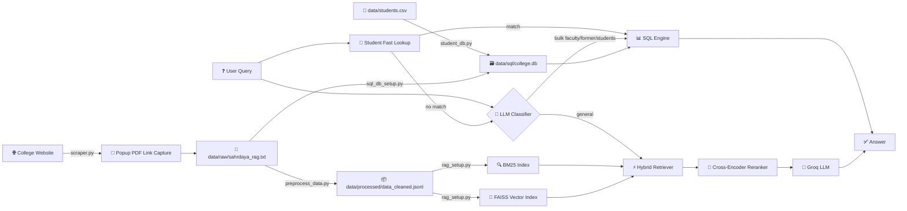

**The pipeline has 6 stages:**

| Stage | What happens | File |
|---|---|---|
| 1. Scrape | Crawl the college website, extract text, capture popup PDF links | `scraper.py` |
| 2. Preprocess | Clean, categorise, chunk, inject aliases, structure former people | `preprocess_data.py` |
| 3. Structured DB | Build shared SQLite data: faculty + former people + students + interests | `sql_db_setup.py`, `student_db.py` |
| 4. Index | Build BM25 + FAISS search indexes | `rag_setup.py` |
| 5. Route | Student-name fast path + LLM classification for SQL (bulk faculty/former/students) vs RAG | `rag_setup.py` |
| 6. Generate | SQL formatted output for entity queries, LLM answer for general queries | `rag_setup.py` |

---

## Stage 1: Web Scraping

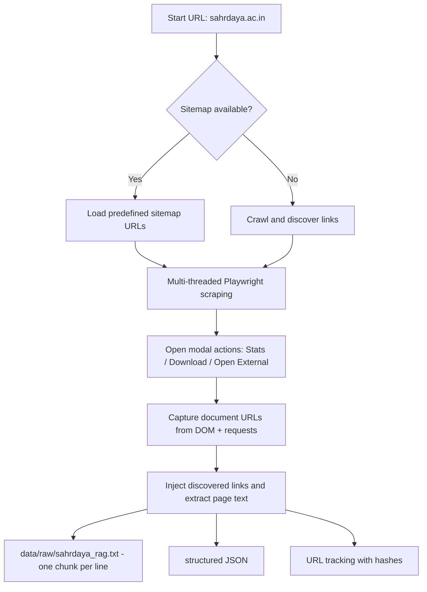

- **Multi-threaded** crawler with Playwright support for JavaScript-heavy pages
- Auto-detects `sahrdaya.ac.in` and uses a predefined **sitemap** (~150 routes + department sub-pages across 7 departments) for complete coverage
- Outputs **RAG-ready TSV** format: `chunk_id\tcontent` (one page = one chunk)
- Tracks URLs with **SHA-256 content hashes** to detect changes on re-scrape
- Supports `--single` mode for appending individual pages without full re-crawl

### 1.1 Thread Safety

Concurrent crawling requires shared state. The scraper uses four thread-safe primitives:

| Primitive | Purpose |
|---|---|
| `ThreadSafeSet` | Tracks visited URLs — prevents duplicate crawls |
| `ThreadSafeList` | Collects scraped page data from all threads |
| `RateLimiter` | Enforces minimum delay between requests (politeness) |
| `ThreadSafeCounter` | Progress tracking across threads |

All use `threading.Lock` internally for mutual exclusion.

### 1.2 Playwright Rendering and Popup Link Capture

Many pages on `sahrdaya.ac.in` are Firestore-backed SPAs — the HTML served by the server is a skeleton, and the actual content is loaded by JavaScript. The scraper:

1. Launches a headless Chromium browser via Playwright
2. Waits for `load` event (falls back to `domcontentloaded` on timeout)
3. **Scrolls to the bottom** of the page to trigger lazy loading
4. Clicks modal-driven actions (for example: Stats, Download, Open External) to reveal hidden document URLs
5. Captures URLs from both DOM attributes and browser request events
6. Injects discovered links into the extracted HTML before BeautifulSoup parsing
7. Waits for content to settle and extracts text

This ensures JavaScript-rendered faculty profiles, department pages, and announcements are fully captured.
It also ensures modal-only placement/statistics PDF links are persisted as `Document Links` in scraped output.

### 1.3 Multiple Output Formats

The scraper produces four output files:

| File | Format | Purpose |
|---|---|---|
| `<prefix>_rag.txt` | `chunk_id\tcontent` per line | Primary input for the RAG pipeline (`data/raw/sahrdaya_rag.txt`) |
| `<prefix>_raw.txt` | Combined raw text | Full text dump for debugging |
| `<prefix>_structured.json` | Structured JSON (via Groq or local fallback) | Rich page metadata |
| `<prefix>_tracking.json` | URL → hash + chunk mappings | Change detection on re-scrape |

**Output**: `data/raw/sahrdaya_rag.txt` — ~785 raw chunks, one per line.

---

## Stage 2: Preprocessing

Raw scraped text is noisy and unevenly sized. The preprocessor transforms it into clean, optimised chunks.

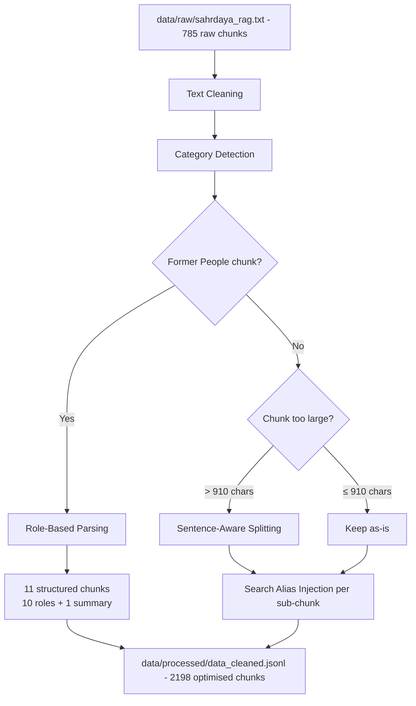

### 2.1 Text Cleaning

Web pages contain UI noise that confuses search engines. We strip it out:

```
BEFORE:  "Back to Home Refresh View PDF Dr. Jis Paul Head of Department CSE Download"
AFTER:   "Dr. Jis Paul Head of Department CSE"
```

What gets removed:
- Button labels: "Back to Home", "View PDF", "Download", "Refresh"
- Form artifacts: "Select First Preference", "Drop here to move to end"
- Excessive whitespace and empty bullet points

### 2.2 Category Detection

Each chunk is scanned against 18 regex rules and tagged with matching categories:

```
Input:  "Dr. Jis Paul, Assistant Professor, Computer Science Engineering, published 5 papers..."
Tags:   [faculty, department_cse, research]
```

These tags are **prepended** to the chunk text as `[faculty, department_cse, research]`. This is important because:
- A chunk about a CSE professor might not contain the word "faculty" — the tag adds it
- BM25 and vector search both benefit from the extra keywords
- Categories act as a lightweight metadata layer

| Category | Example matches |
|---|---|
| `faculty` | professor, HOD, teaching staff |
| `department_cse` | Computer Science, CSE |
| `department_ece` | Electronics and Communication, ECE |
| `placement` | placement, internship, recruitment |
| `admissions` | admission, eligibility, KEAM |
| `clubs` | NSS, IEDC, PALS, committee |
| `infrastructure` | hostel, library, lab, campus |
| `about` | vision, mission, website team |
| `research` | publication, journal, patent |
| `governance` | IQAC, NAAC, NBA, academic council |
| ... | *18 categories total* |

### 2.3 Sentence-Aware Chunking

This is crucial for retrieval quality. Here's the problem and solution:

```
❌ CHARACTER-BASED SPLIT (bad):
  Chunk 1: "...Dr. Jis Paul is the Head of Depart"
  Chunk 2: "ment of Computer Science Engineering..."
  → Name and role split across chunks — neither chunk has complete info

✅ SENTENCE-AWARE SPLIT (good):
  Chunk 1: "...Dr. Jis Paul is the Head of Department of Computer Science Engineering."
  Chunk 2: "He has published 5 research papers..."
  → Each chunk has complete, meaningful sentences
```

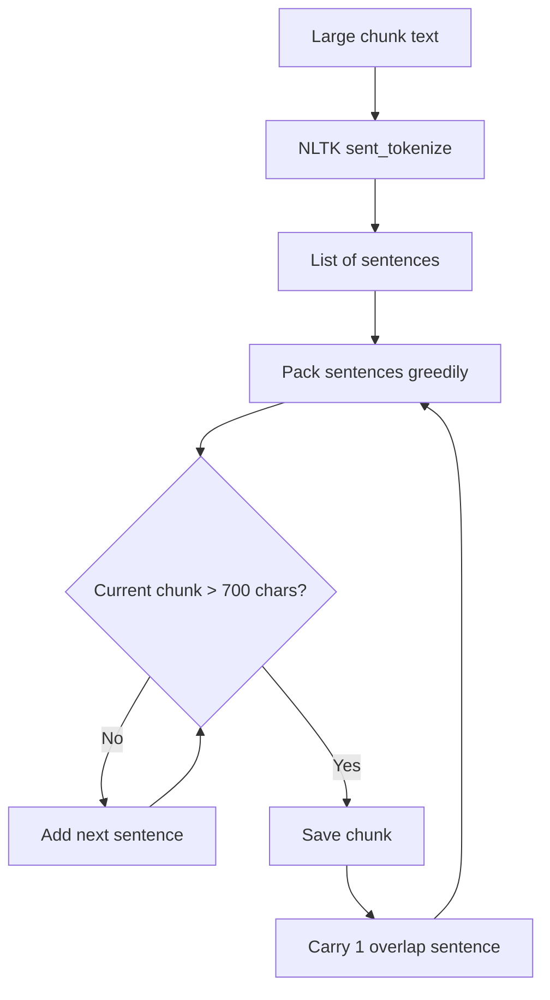

How it works:
1. **NLTK's `sent_tokenize`** splits text into sentences
2. Sentences are **greedily packed** into chunks up to ~700 characters
3. **1 overlap sentence** is carried to the next chunk for context continuity
4. **Markdown table rows** are kept as atomic units (never broken mid-row)
5. Oversized sentences (>700 chars) are hard-wrapped at word boundaries

| Parameter | Value | Why |
|---|---|---|
| `CHUNK_SIZE` | 700 chars | Fits ~175 tokens — enough for one concept, small enough for precise retrieval |
| `OVERLAP_SENTENCES` | 1 | Prevents losing context at chunk boundaries |
| `SPLIT_THRESHOLD` | 910 chars | Only split chunks larger than this — avoids unnecessary fragmentation |

Result: ~71% of output chunks end at a natural sentence boundary.

### 2.4 Search Alias Injection

Users type names differently than how they appear in documents. This bridges the gap:

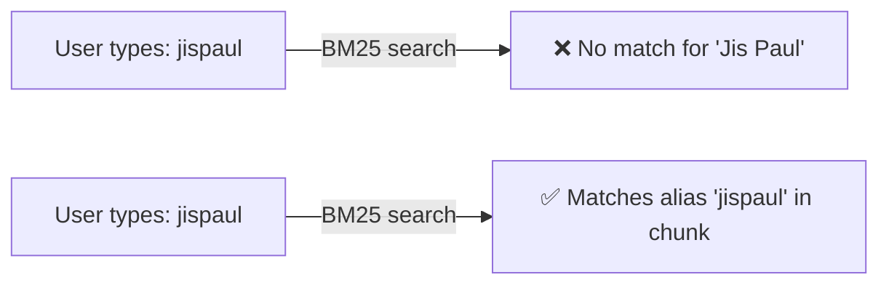

For each chunk, we detect names and append concatenated aliases:

```
Original chunk:  "Dr. Jis Paul Head of Department Computer Science Engineering"
After aliases:   "Dr. Jis Paul Head of Department CSE\n[search aliases: JisPaul | jispaul]"
```

**Types of aliases:**

| Pattern detected | Alias generated | Example |
|---|---|---|
| `Dr./Mr./Ms. First Last` | `FirstLast`, `firstlast` | Dr. Jis Paul → `JisPaul`, `jispaul` |
| `Professor First Last` | `FirstLast` | Professor Ambily Francis → `AmbilyFrancis` |
| `HOD` | `HODs Head of Department` | Term expansion |
| Manual entries | Custom aliases | Aaron Thomas → `AaronThomas aaronthomas website team` |

**Specific name aliases** are defined for people whose names contain very common parts (e.g., "Thomas" appears 100+ times in the dataset). Without explicit aliases, BM25 can't distinguish them:

| Person | Aliases injected |
|---|---|
| Aaron Thomas | `AaronThomas aaronthomas website team backend developer` |
| Shayen Thomas | `ShayenThomas shayenthomas website team infrastructure developer` |
| Mishal Shanavas | `MishalShanavas mishalshanavas website team devops` |
| Mathew Geejo | `MathewGeejo mathewgeejo website team frontend developer` |

Aliases are injected **per sub-chunk** — every piece gets its own relevant aliases based on what names appear in it.

### 2.5 Former People — Structured Role-Based Splitting

The "Former People" page lists all past leadership under role headings (Chairman, Manager, Executive Director, Finance Officer, Advisor, Director, Principal, Vice Principal, Media Director, College Chairpersons) — but in the raw scraped data it's one long flat string with roles and names mixed inline. The generic sentence splitter breaks this across chunk boundaries, making it impossible for the LLM to correctly list all people under a specific role.

```
❌ GENERIC SPLITTING (bad):
  Chunk 1: "...Finance Officer Fr. Joseph Kizhakkumthala 2024 - 2025 Fr."
  Chunk 2: "Jinto Verampilavu 2020 - 2024 Fr. Jinoj Kolenchery 2019 - 2020..."
  → Role boundary broken — chunk 2 has no "Finance Officer" label
  → Query "list all former Finance Officers" misses entries in chunk 2

✅ STRUCTURED SPLITTING (good):
  Chunk: "Former Finance Officer of SCET:
    - Fr. Joseph Kizhakkumthala (2024 - 2025)
    - Fr. Jinto Verampilavu (2020 - 2024)
    - Fr. Jinoj Kolenchery (2019 - 2020)
    - Fr. Thomas Velakkanadan (2013 - 2019)
    - Rev. Fr. Jino Malakkaran (2010 - 2013)
    - Rev. Fr. Dr. Antu Alappadan (2007 - 2010)"
  → Complete, self-contained, with role label
```

The preprocessor detects the "Former People" chunk and:

1. **Parses role sections** using known role labels as delimiters
2. **Extracts (name, year_from, year_to)** tuples using regex within each section
3. **Merges chunk_14 tail** into chunk_13 (College Chairpersons were split across raw chunks)
4. **Emits one sub-chunk per role** with a clear header and structured list
5. **Emits a summary chunk** listing all roles with person counts

**Result: 11 structured chunks** replacing the 3 broken generic chunks:

| Chunk ID | Content |
|---|---|
| `chunk_13_former_summary` | Overview: 10 roles, person counts |
| `chunk_13_former_chairman` | 1 former Chairman |
| `chunk_13_former_manager` | 6 former Managers |
| `chunk_13_former_executive_director` | 6 former Executive Directors |
| `chunk_13_former_finance_officer` | 6 former Finance Officers |
| `chunk_13_former_advisor` | 2 former Advisors |
| `chunk_13_former_director` | 4 former Directors |
| `chunk_13_former_principal` | 4 former Principals |
| `chunk_13_former_vice_principal` | 3 former Vice Principals |
| `chunk_13_former_media_director` | 4 former Media Directors |
| `chunk_13_former_college_chairpersons` | 16 former College Chairpersons |

---

## Stage 3: Indexing

The processed chunks are loaded into **two complementary search indexes**. This is where the magic happens — each index catches what the other misses.

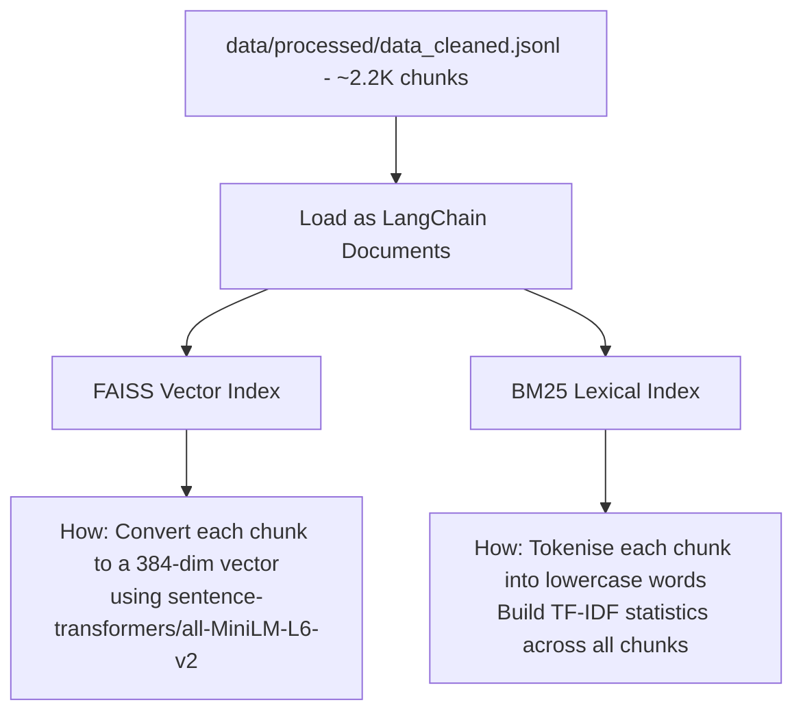

> **Fallback**: If `data/processed/data_cleaned.jsonl` doesn't exist (first run without preprocessing), the system falls back to loading `data/raw/sahrdaya_rag.txt` directly with `RecursiveCharacterTextSplitter` (chunk_size=700, overlap=150). This produces unoptimised chunks — run `preprocess_data.py` for best results.

### 3.1 FAISS Vector Index (Semantic Search)

Think of this as **"search by meaning"**:

```
Query:    "campus facilities"
Matches:  "...hostel accommodation with 24-hour security, cafeteria, library..."
Why:      Vectors for "facilities" and "hostel/cafeteria/library" are close in embedding space
```

- **Embedding model**: `sentence-transformers/all-MiniLM-L6-v2` (384-dimensional, runs locally — no API needed)
- Each chunk becomes a dense vector. At query time, the query is also vectorised, and we find chunks with the **closest vectors** (cosine similarity)
- Uses **MMR (Maximal Marginal Relevance)** to diversify results

**Strengths**: Handles paraphrased queries, synonyms, conceptual similarity.
**Weakness**: Can miss rare proper names ("Minnuja") since they have no semantic meaning to the model.

### 3.2 BM25 Index (Lexical/Keyword Search)

Think of this as **"search by exact words"**:

```
Query:    "minnuja"
Matches:  "...Ms. Minnuja Shelly Placement Coordinator CSE..."
Why:      The word "minnuja" literally appears in the chunk
```

- Uses **BM25Okapi** algorithm (the same algorithm behind Elasticsearch)
- Documents and queries are **lowercased** then split by whitespace (custom preprocessor — the default doesn't lowercase, which caused bugs with names like "Minnuja" vs "minnuja")
- Scores based on: **Term Frequency** (how often the word appears in the chunk) × **Inverse Document Frequency** (how rare the word is across all chunks) × **Length normalisation**

**Strengths**: Perfect for exact names, abbreviations, rare terms.
**Weakness**: Can't understand meaning — "college head" won't match "principal".

### 3.3 Why Both? — The Complementary Advantage

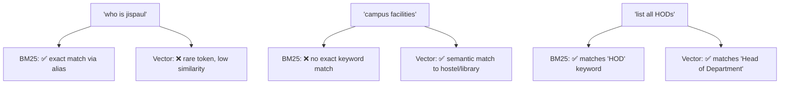

| Query Type | BM25 | Vector | Winner |
|---|---|---|---|
| Exact name: "who is jispaul" | ✅ alias match | ❌ rare token | **BM25** |
| Conceptual: "campus facilities" | ❌ no keywords | ✅ semantic similarity | **Vector** |
| Mixed: "list all HODs" | ✅ keyword match | ✅ semantic match | **Both** |

Neither alone is sufficient. Together, they cover the full spectrum of queries.

### 3.4 Index Caching & Persistence

Building FAISS + BM25 indexes from scratch takes ~50 seconds (embedding 2,191 chunks). To avoid this on every startup, indexes are cached to disk and reloaded in ~0.1 seconds.

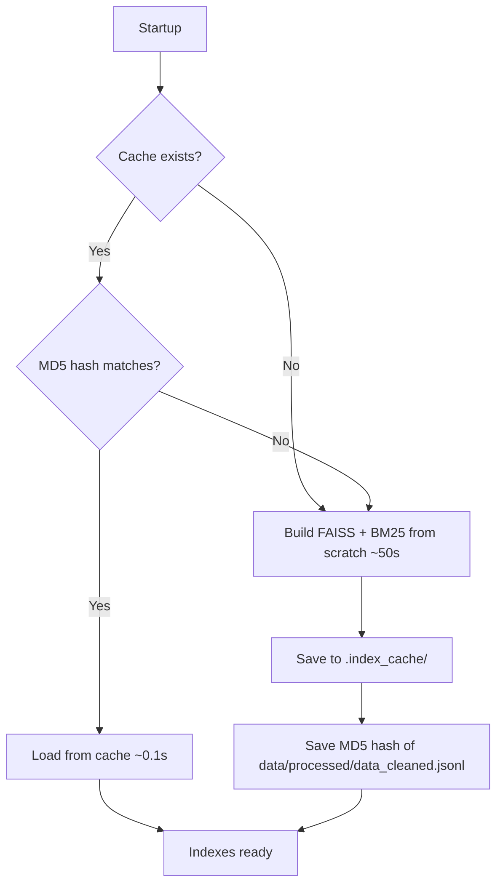

**Cache directory structure:**

```
.index_cache/
├── faiss/              # FAISS vector index (saved with vectorstore.save_local())
├── bm25.pkl            # BM25 retriever (k=8), pickled
├── bm25_large.pkl      # BM25 retriever (k=50), pickled
└── data_hash.txt       # MD5 hash of data/processed/data_cleaned.jsonl
```

**How invalidation works:**
1. On each startup, compute the **MD5 hash** of `data/processed/data_cleaned.jsonl`
2. Compare it with the hash stored in `data_hash.txt`
3. If they match → load cached indexes (fast path)
4. If they differ → rebuild everything from scratch and update the cache

This means whenever you re-run `preprocess_data.py` and the output changes, the next startup will automatically rebuild the indexes with the new data.

---

## Stage 4: Hybrid Retrieval

This is the core of the system — how we combine both indexes to find the best chunks for any query.

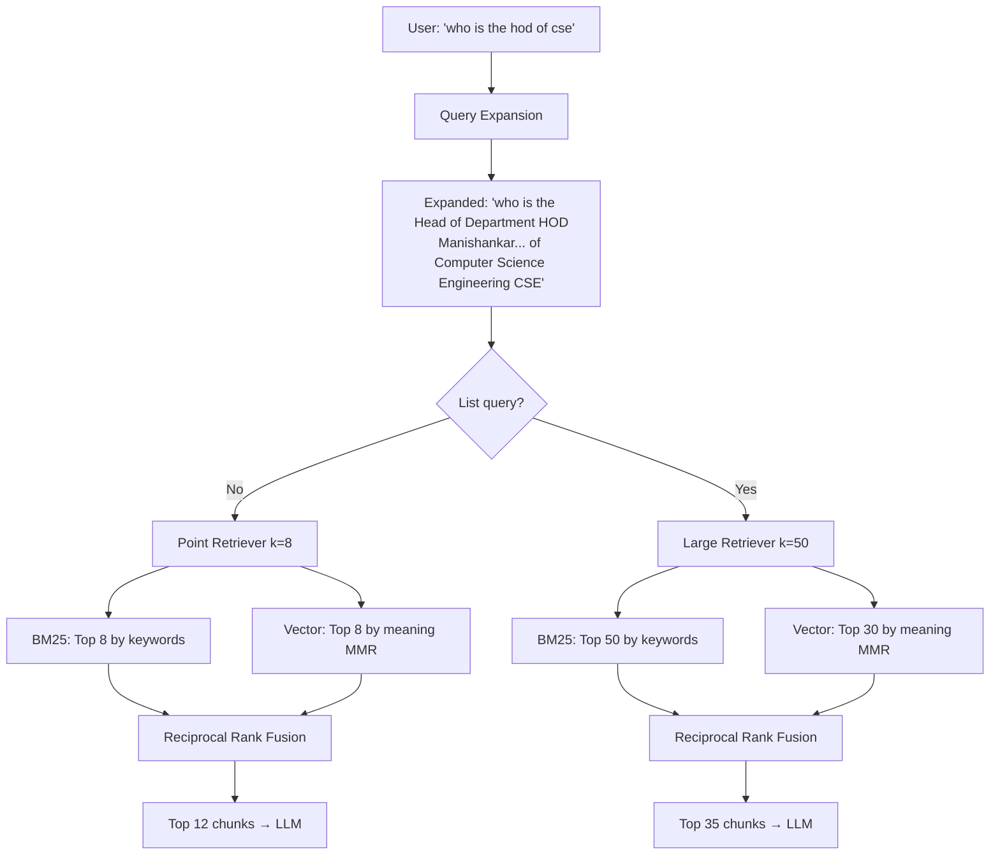

### 4.1 Query Expansion

Before searching, abbreviations and short terms are expanded so both indexes get more to work with:

```
INPUT:   "who is the hod of cse"
OUTPUT:  "who is the Head of Department HOD Manishankar Drisya Dhanya
          Vijikala Sukhila Jis Paul Ambily Francis
          of Computer Science Engineering CSE"
```

This is regex-based — fast and predictable. Expansions are defined for:
- Department abbreviations: CSE, ECE, EEE, BME, BT, ASH, CE, ME
- Leadership roles: principal, chairman, executive director
- Common terms: placement, admission

### 4.2 Ensemble Retriever (Reciprocal Rank Fusion)

Both indexes return their own ranked list of chunks. **Reciprocal Rank Fusion (RRF)** merges them:

```
BM25 ranking:    [chunk_A (#1), chunk_B (#2), chunk_C (#3), ...]
Vector ranking:  [chunk_C (#1), chunk_D (#2), chunk_A (#3), ...]

RRF formula: score(doc) = weight₁/(k + rank_bm25) + weight₂/(k + rank_vector)

chunk_A: 0.6/(60+1) + 0.4/(60+3) = 0.0098 + 0.0063 = 0.0161  ← highest
chunk_C: 0.6/(60+3) + 0.4/(60+1) = 0.0095 + 0.0066 = 0.0161  ← tied
chunk_B: 0.6/(60+2) + 0.4/(60+∞) = 0.0097 + ~0     = 0.0097
chunk_D: 0.4/(60+2) + 0.6/(60+∞) = 0.0065 + ~0     = 0.0065
```

Documents that rank high in **both** indexes get the best combined score. This is why hybrid beats either alone.

```python
retriever = EnsembleRetriever(
    retrievers=[bm25_retriever, vector_retriever],
    weights=[0.6, 0.4],   # BM25 weighted higher — most queries are keyword-based
)
```

### 4.3 Adaptive Retrieval

The system detects the query type and adjusts how much it retrieves:

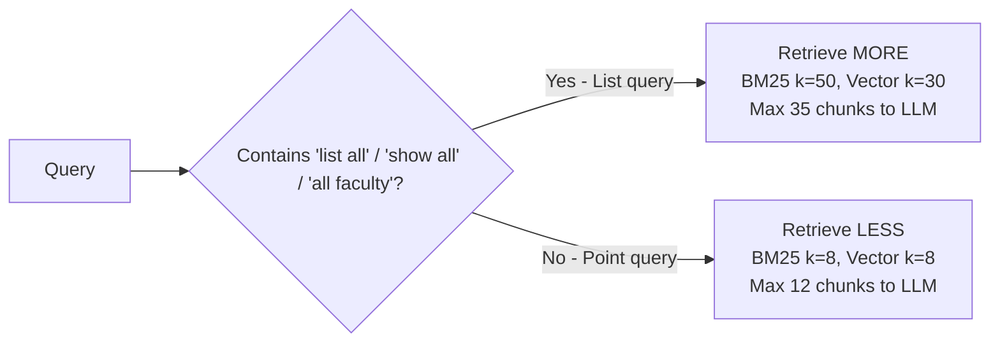

Why? "List all HODs" needs to find 7+ people scattered across different chunks. "Who is the principal" only needs 1-2 chunks. Retrieving too much for point queries adds noise; retrieving too little for list queries misses items.

### 4.4 MMR Diversity

Without MMR, vector search can return 8 chunks that all say nearly the same thing. **Maximal Marginal Relevance** penalises redundancy:

```
Standard similarity:  Returns chunks ranked ONLY by relevance
  → Top 3 might all be about "CSE HOD Jis Paul" from slightly different pages

MMR:  Returns chunks ranked by relevance MINUS similarity to already-selected chunks
  → Top 3 cover: "CSE HOD", "CSE activities", "CSE placements"
```

| Query Type | `lambda_mult` | Behaviour |
|---|---|---|
| Point query | 0.7 | Mostly relevance, slight diversity |
| List query | 0.5 | Balanced — actively avoids duplicate info |

### 4.5 Cross-Encoder Reranking

After hybrid retrieval and MMR, the results are **reranked** using a cross-encoder model. This is the single biggest quality boost over basic hybrid retrieval.

**Why reranking matters:**

BM25 and vector search are **bi-encoders** — they encode the query and documents *independently*, then compare representations. A cross-encoder encodes the (query, document) pair **together**, allowing it to model fine-grained interactions between words.

```
Bi-encoder (FAISS):     encode(query) vs encode(doc)  → fast, approximate
Cross-encoder (reranker): encode(query + doc together) → slow, precise
```

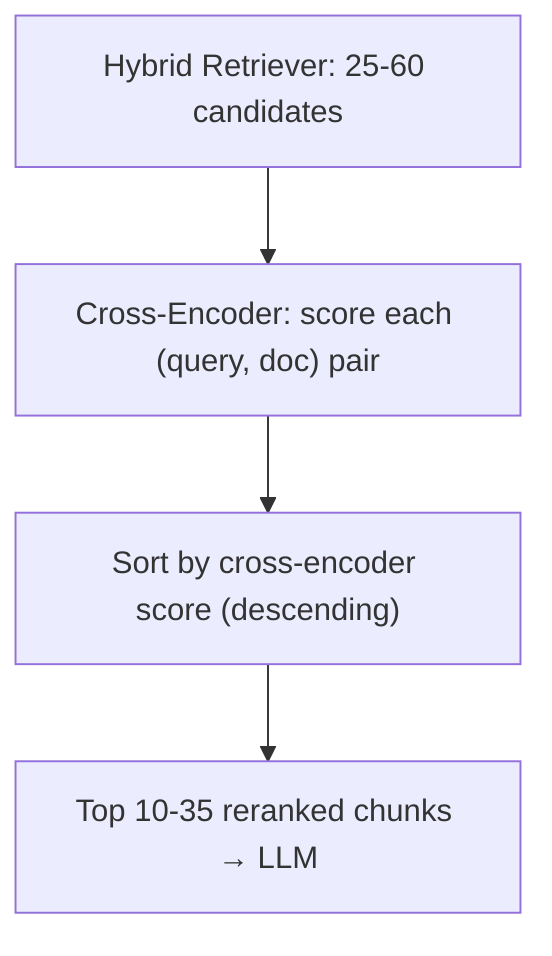

**How it works in the pipeline:**

| Query Type | Candidates Retrieved | After Reranking |
|---|---|---|
| Point query | 25 (BM25 8 + Vector 8, fused) | Top 10 by cross-encoder score |
| List query | 60 (BM25 50 + Vector 30, fused) | Top 35 by cross-encoder score |

The key insight: we **over-retrieve** candidates (more than we'll send to the LLM), then let the cross-encoder pick the best ones. This means even if RRF ranks a less-relevant chunk at position 5, the reranker can push it down.

**Model**: `cross-encoder/ms-marco-MiniLM-L-6-v2`
- ~22 MB, runs locally (no API key needed)
- Trained on MS MARCO passage ranking — optimised for exactly this use case
- Scores 25 candidates in ~50-100ms on CPU

**Example of reranking impact:**

```
Query: "who is the placement coordinator of CSE"

Before reranking (hybrid retrieval order):
  #1  chunk about CSE department overview          (generic CSE info)
  #2  chunk about Minnuja Shelly placement officer  ✓ relevant
  #3  chunk about CSE faculty list                  (partial match)
  #4  chunk about placement statistics              (wrong type)

After reranking (cross-encoder rescored):
  #1  chunk about Minnuja Shelly placement officer  ✓ most relevant
  #2  chunk about CSE department overview           (supporting context)
  #3  chunk about placement statistics              (related)
  #4  chunk about CSE faculty list                  (least relevant)
```

The cross-encoder correctly identifies that the Minnuja chunk directly answers the question, even though the bi-encoder scored the generic CSE chunk higher.

---

## Stage 5: Answer Generation

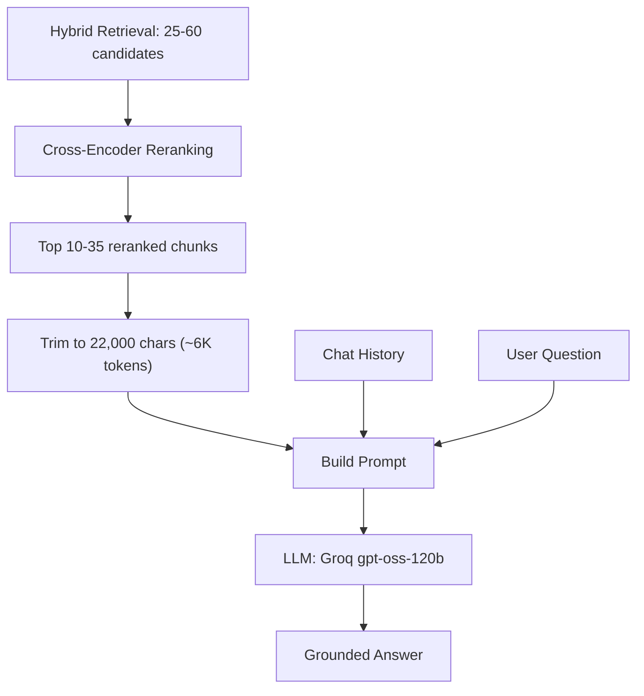

### 5.1 LLM

- **Model**: `openai/gpt-oss-120b` via Groq API
- Fast inference (~50-100 tok/s) via Groq's optimised hardware

### 5.2 Prompt Design

The prompt is specifically tuned for the college domain:

```
You are the official AI assistant for Sahrdaya College of Engineering & Technology...

CONVERSATION HISTORY: {chat_history}
CONTEXT: {retrieved_chunks}
QUESTION: {user_question}

INSTRUCTIONS:
- Answer strictly from the context (no hallucination)
- Include names, roles, dates when available
- Key leadership: Principal = Dr. Ramkumar S, Chairman = Mar Pauly Kannookadan...
- For LIST queries: show ALL matching items in a numbered list
- If answer not in context: suggest contacting admission@sahrdaya.ac.in
- Redirect non-college queries to Sahrdaya topics
```

Key design decisions:
- **"Answer strictly from context"** — prevents hallucination
- **Leadership names hardcoded** — these are frequently asked and critical to get right
- **Contact fallback** — graceful degradation when the answer isn't in the data
- **Conversation history injected** — allows follow-up questions ("what about their research?")

### 5.3 Context Window Management

Retrieved chunks are concatenated with `---` separators under a character budget:

```
MAX_CONTEXT_CHARS = 22,000 (~6,000 tokens)

If total chunks exceed budget:
  → Last chunk is truncated with "..."
  → Earlier chunks preserved in full (they're more relevant)
```

### 5.4 Conversation History

Chat history is maintained as a rolling list and injected into every prompt:

```
User: who is the hod of cse
Assistant: Dr. Jis Paul is the HOD of CSE...

User: what about his research?          ← Pronoun "his" resolved via history
Assistant: Dr. Jis Paul has published...
```

---

## SQL-Based Entity Queries (LLM-Generated SQL)

Bulk entity queries are handled by a **structured SQL pipeline** instead of RAG. The LLM classifies each query and, if it requires listing, filtering, or aggregating **multiple** records, generates a SQL query to run against the shared SQLite database.

Single-person faculty queries like "who is the HOD of CSE" are **not** routed to SQL — they go through normal RAG for a natural-language answer. Single-student lookups such as "who is aaron" use a deterministic SQL fast path.

### Former People — SQL Table

Former people (past Chairmen, Managers, Principals, Vice Principals, etc.) are stored in a dedicated `former_people` table in `data/sql/college.db`. The LLM classifier routes "former" queries to SQL just like bulk faculty queries — no special regex bypass needed.

```
User: "list all former Principals"
→ LLM generates: SELECT name, role, start_year, end_year FROM former_people WHERE role = 'Principal'
→ SQL returns 4 rows: Dr. Nixon Kuruvila, Dr. Sudha George Valavi, Prof. K T Joseph, Dr. M S Jayadeva
```

The `former_people` table has 52 records across 10 roles (Chairman, Manager, Executive Director, Finance Officer, Advisor, Director, Principal, Vice Principal, Media Director, College Chairpersons). It is built by `sql_db_setup.py` by parsing the "Former People" section of `data/raw/sahrdaya_rag.txt`.

### Student Profiles + Interests — SQL Tables

Student data is loaded from `data/students.csv` into three normalized tables in `data/sql/college.db`:

- `students` (profile columns including `bio`, `photo_url`, `projects_links`, social links)
- `interests` (canonical interest dictionary)
- `student_interests` (many-to-many links)

This supports queries like:

```
User: "people who likes chess"
→ LLM generates SQL JOIN across students + student_interests + interests
→ Returns all matching students with consistent canonical interest matching

User: "who is aaron"
→ student-name fast path resolves record directly
→ Returns formatted profile including photo URL and projects links
```

### Why not use RAG for bulk faculty queries?

**Problem 1: Multi-Constraint Filtering**
A query like "CSE faculty with PhD and more than 5 publications" requires filtering by department AND PhD status AND publication count. RAG retrieval can't do precise multi-attribute filtering — it just finds "relevant" chunks.

**Problem 2: Context Window Overflow**
A department can have 20+ faculty. Each person's data lives in a separate chunk. Our context budget (~6,000 tokens) can't fit them all, so the LLM would miss entries.

**Problem 3: LLM Extraction Errors**
Even with enough context, LLMs are unreliable at extracting long structured lists — they skip entries, mix up attributes, and format inconsistently.

**Problem 4: Aggregation Queries**
"How many CSE faculty have PhDs?" requires counting. RAG can't aggregate — it can only retrieve and hope the LLM counts correctly.

### The SQL Solution

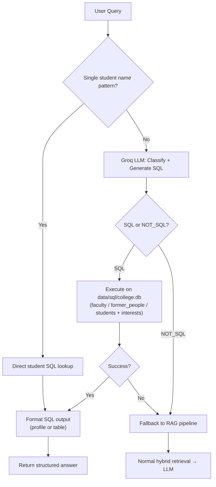

### How the Shared Database is Built

`sql_db_setup.py` parses raw `data/raw/sahrdaya_rag.txt` and builds faculty + former people tables, then invokes `student_db.py` to load student profiles/interests from `data/students.csv` into the same `data/sql/college.db`.

Faculty parsing is now format-tolerant:
- Legacy rich profile blocks (`Back to Faculty Directory`)
- Current listing/card chunks (`View Profile` / `View Full Profile`)

1. **Faculty Profiles** (~109 current snapshot) — Parsed from both rich profile blocks and listing/card entries, then deduplicated by email
2. **Former People** (52 records) — Past office-bearers parsed from the "Former People" section into a separate `former_people` table
3. **Students CSV** — Student profiles normalized into `students`, `interests`, and `student_interests`

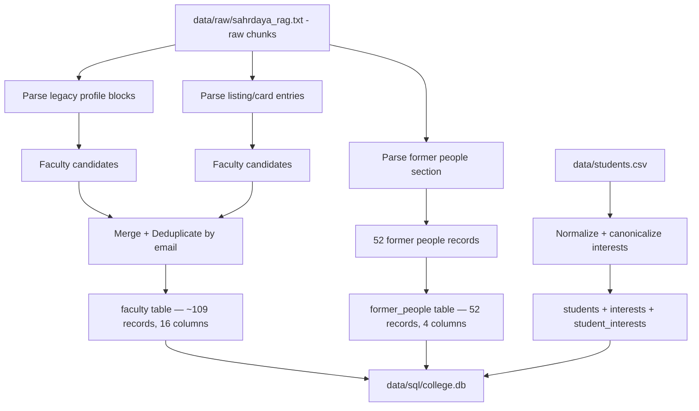

**Faculty Table Schema** (16 columns):

| Column | Type | Description |
|---|---|---|
| `name` | TEXT | Faculty name (cleaned, title-cased) |
| `designation` | TEXT | Professor, Associate Professor, HOD, etc. |
| `department` | TEXT | Full department name |
| `email` | TEXT | College email address |
| `has_phd` | BOOLEAN | 1 if PhD completed |
| `phd_pursuing` | BOOLEAN | 1 if currently pursuing PhD |
| `experience_years` | REAL | Years of experience |
| `publications` | INTEGER | Number of publications |
| `research` | INTEGER | Number of research projects |
| `awards` | INTEGER | Number of awards |
| `patents` | INTEGER | Number of patents |
| `books` | INTEGER | Number of books authored |
| `joined` | DATE | Date of joining |
| `research_areas` | TEXT | Areas of research interest |
| `education` | TEXT | Educational qualifications |
| `memberships` | TEXT | Professional memberships (IEEE, ISTE, etc.) |

**Former People Table Schema** (4 columns):

| Column | Type | Description |
|---|---|---|
| `name` | TEXT | Person's full name |
| `role` | TEXT | Chairman, Manager, Principal, Vice Principal, etc. |
| `start_year` | INTEGER | Year they started the role |
| `end_year` | INTEGER | Year they ended the role |

**PhD Detection** handles edge cases in the raw data:
- Standard: "Ph.D", "PhD", "Doctor of Philosophy"
- Pursuing: "Ph.D.-doing", "Pursuing P.hD", "pursuing a Ph.D."
- Title: "Dr." prefix → marks as PhD completed
- Distinction: `has_phd=1` (completed) vs `phd_pursuing=1` (in progress)

### SQL Classification Prompt

Every user query is sent to the Groq LLM with the full database schema. The LLM decides:
- **Generate SQL** — only for bulk/list/filter/aggregate queries about multiple faculty
- **`NOT_SQL`** — for single-person lookups, general college questions, or anything outside the faculty database

```
User: "list all CSE faculty with PhD"     → SQL (bulk list with filter)
LLM:  SELECT name, designation, email FROM faculty
      WHERE department LIKE '%Computer Science Engineering%' AND has_phd = 1
      ORDER BY name

User: "how many ECE faculty have PhDs"     → SQL (aggregate count)
LLM:  SELECT COUNT(*) FROM faculty WHERE has_phd = 1
      AND department LIKE '%Electronics and Communication Engineering%'

User: "who is the HOD of CSE"              → NOT_SQL (single person → RAG)
User: "what are the admission requirements" → NOT_SQL (not faculty data → RAG)
User: "list all former Principals"          → SQL (SELECT from former_people WHERE role = 'Principal')
```

**Key routing distinction:** "who is the HOD of CSE" = NOT_SQL (single person, answered better by RAG with natural language). "list all HODs" = SQL (multiple people, needs structured table).

The prompt includes:
- The complete database schema with column descriptions
- Department aliases (CSE = Computer Science Engineering, ECE = Electronics and Communication Engineering, etc.)
- SQL guidelines (use LIKE with %keyword% for departments, exact match for former_people roles, handle counts with COUNT(*), etc.)
- Explicit examples of what should and shouldn't be SQL
- Safety: only SELECT queries are allowed — the executor rejects anything else

### SQL Execution & Formatting

Results are formatted as clean markdown tables with smart display:
- `has_phd` → "Yes"/"No"
- Column headers title-cased and human-readable
- Row numbers added automatically
- Total count appended at the bottom
- COUNT(*) queries show just the count

### Fallback

If SQL execution fails (bad query, database locked, etc.), the system **falls back to the RAG pipeline** transparently. The user always gets an answer.

| Factor | RAG Pipeline | SQL Pipeline |
|---|---|---|
| **Multi-constraint** | ❌ Can't filter by multiple attributes | ✅ Full SQL WHERE clauses |
| **Aggregation** | ❌ LLM must count manually | ✅ COUNT, AVG, GROUP BY |
| **Completeness** | ❌ Limited by retrieval k and context | ✅ Queries entire database |
| **Speed** | ~2-3s (API + retrieval) | ~1s (classification only) |
| **Accuracy** | ⚠️ LLM may hallucinate | ✅ Exact database results |

### Token Overflow Protection

SQL result tables can be very large (e.g., 35 rows × 16 columns for "list all CSE faculty"). Without protection, storing these in chat history causes token limit errors on subsequent LLM calls (Groq's 8,000 TPM limit).

Two safeguards are in place:

**1. Classifier History Truncation**
The SQL classification prompt only receives the **last ~1,500 characters** (~400 tokens) of conversation history. The classifier only needs recent context to understand intent — not full SQL result tables from previous queries.

```
Full chat history:  ~35,000 chars (after a big faculty list query)
Sent to classifier: last 1,500 chars (just recent Q&A context)
```

**2. Compact History Storage**
When a SQL query returns **more than 5 rows**, only a one-line summary is stored in chat history instead of the full table:

```
Stored: "[SQL result: 35 rows from faculty database for query: SELECT * FROM faculty WHERE ...]"
Instead of: the entire 35-row markdown table
```

The full table is still displayed to the user — only the history storage is compressed. This prevents the RAG prompt and subsequent SQL calls from exceeding token limits.

---

## Interactive CLI & Session Analytics

The chatbot runs as a terminal application (`main.py`) with built-in session tracking, slash commands, and ASCII visualisations. This isn't just a bare input/output loop — it's a full diagnostic environment.

### Query Flow

Every query follows this dual-path flow:

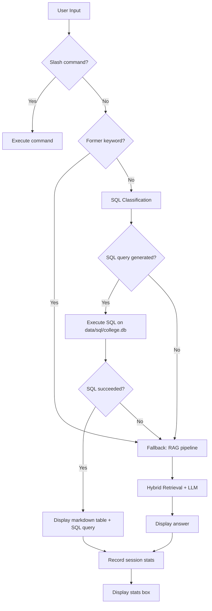

### Session Stats Tracking

After every query (SQL or RAG), a stats box is displayed:

```
+----------------------------------------------------+
|                       STATS                        |
+----------------------------------------------------+
|  Response Time    : 1.84s                          |
|  Speed            : ~142 tok/s                     |
|  Prompt Tokens    : ~12                            |
|  Response Tokens  : ~261                           |
|  Context Tokens   : ~5482  (12 docs)               |
|  History Tokens   : ~0                             |
|  Total Window     : ~5755 tokens (22.5 KB)         |
|  Chat Turn        : #1                             |
|  Chunks Retrieved : 204_p1, 37_p0, 204_p0, ...    |
+----------------------------------------------------+
```

Tracked per query:
| Metric | How it's calculated |
|---|---|
| Response Time | Wall-clock time including SQL classification + retrieval + LLM |
| Speed | Response tokens ÷ response time |
| Prompt/Response/History/Context Tokens | Estimated as `len(text) // 4` |
| Total Window | Sum of all token categories |
| Chunks Retrieved | Sub-chunk IDs from retrieval metadata |

Token estimation uses the `len(text) // 4` heuristic — roughly 4 characters per token for English text. Not exact, but good enough for monitoring context window usage.

### Slash Commands

| Command | What it does |
|---|---|
| `/graph` | Full session dashboard with charts (see below) |
| `/chunks` | Show chunk IDs used in the last retrieval |
| `/history` | Show condensed conversation history (truncated to 80 chars) |
| `/stats` | Re-display the stats box from the last query |
| `/clear` | Clear conversation history (keeps session stats) |
| `/reset` | Reset both session stats and conversation history |
| `/help` | Show all available commands |

### `/graph` — Session Dashboard

The `/graph` command renders a full ASCII dashboard with multiple visualisations:

```
+==============================================================+
|                      SESSION DASHBOARD                       |
+==============================================================+
  Session Duration : 127s  |  Queries : 4

  RESPONSE TIME (seconds)
  ------------------------------------------------
  Q1     |████████████████░░░░░░░░░░░░░░| 1.84
  Q2     |██████████████████████████████| 2.31
  Q3     |████████░░░░░░░░░░░░░░░░░░░░░░| 0.52
  Q4     |██████████████████████░░░░░░░░| 1.67

  Timeline : [▃▇▁▅]
             min=0.52s  avg=1.59s  max=2.31s

  TOKEN USAGE PER QUERY
  ------------------------------------------------
  Q1     |▓▓▓▓▓▓▓▓▓▓▓▓▓▓▓▓▓▓▓▓▓▓▓▓░░░░░░| 5755
  Q2     |▓▓▓▓▓▓▓▓▓▓▓▓▓▓▓▓▓▓▓▓▓▓▓▓▓▓░░░░| 6821
  ...

  CHUNK RETRIEVAL HEATMAP (most used)
  ------------------------------------------------
    chunk_204    ████████████████████ (4x)
    chunk_37     ██████████░░░░░░░░░░ (2x)
    chunk_122    █████░░░░░░░░░░░░░░░ (1x)
    ...

  Context Growth : [▂▄▅▇]
                   5755 tok -> 8234 tok

  SUMMARY
  ------------------------------------------------
    Total Queries   : 4
    Avg Response    : 1.59s
    Total Tokens    : ~24,832
    Total Docs Used : 42
    Unique Chunks   : 31
+==============================================================+
```

**Visualisation components:**

| Component | What it shows |
|---|---|
| **Response Time Bar Chart** | Per-query latency with filled/empty block bars |
| **Sparkline** | Compact response time trend using Unicode blocks (`▁▂▃▄▅▆▇█`) |
| **Token Usage Bars** | Total tokens consumed per query |
| **Chunk Heatmap** | Most frequently retrieved chunks across all queries — shows which chunks the system relies on most |
| **Context Growth** | How the context window grows as conversation history accumulates |
| **Summary Table** | Aggregate stats: total queries, average latency, total tokens, unique chunks |

The sparkline is particularly useful for spotting latency spikes across a session. The chunk heatmap reveals if the retriever is over-relying on certain chunks (potential diversity problem).

---

## Deployment Pipeline (Container Runtime)

The project ships with a deployment pipeline that turns source code into a health-gated multi-replica API service behind Nginx.

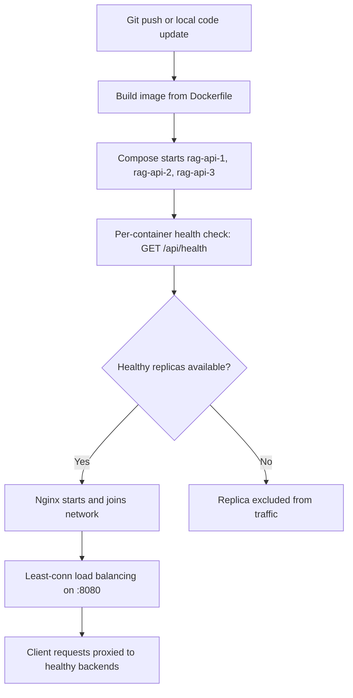

### Runtime Components

| Component | File | Responsibility |
|---|---|---|
| API image | `Dockerfile` | Builds the FastAPI runtime and app code |
| Single-node compose | `docker-compose.yml` | One API container for simple deployments |
| LB compose | `docker-compose.nginx.yml` | Three API replicas + one Nginx proxy |
| Nginx LB config | `deploy/nginx-docker.conf` | Upstream pool, least-conn policy, proxy headers/timeouts |

### Health-Gated Startup

Each API replica runs a health probe:

- Probe target: `http://127.0.0.1:8000/api/health`
- Interval: 15s
- Timeout: 5s
- Retries: 20
- Start period: 120s

Nginx is configured with compose-level health dependencies, so traffic starts only after backends are healthy.

### Release / Redeploy Flow

```bash
docker compose -f docker-compose.nginx.yml build
docker compose -f docker-compose.nginx.yml up -d
docker compose -f docker-compose.nginx.yml ps
docker compose -f docker-compose.nginx.yml logs -f
```

Operational behavior:

1. New images are built from the latest source.
2. Containers are recreated with updated images.
3. Unhealthy replicas do not receive traffic.
4. Nginx continues routing to healthy replicas.

### CI/CD Mapping

For automation (for example, GitHub Actions), map jobs directly to the same runtime pipeline:

1. Build stage: container build from `Dockerfile`.
2. Deploy stage: `docker compose -f docker-compose.nginx.yml up -d`.
3. Verify stage: probe `/api/health` through `:8080`.
4. Fail-fast rule: mark deployment failed if health checks do not pass.

This keeps local deployment and CI/CD deployment behavior consistent.

---

## Summary of Methods

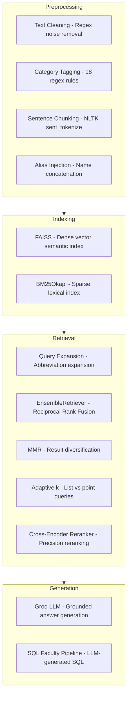

| Method | Where | Purpose |
|---|---|---|
| NLTK `sent_tokenize` | Preprocessing | Sentence boundary detection for clean chunking |
| BM25Okapi | Retrieval | Lexical/keyword search with TF-IDF scoring |
| FAISS + MiniLM-L6-v2 | Retrieval | Dense vector semantic search |
| EnsembleRetriever (RRF) | Retrieval | Fuses BM25 + Vector rankings |
| MMR | Retrieval | Diversifies vector search results |
| Cross-Encoder Reranker | Retrieval | Rescores (query, doc) pairs jointly for precision; `ms-marco-MiniLM-L-6-v2` |
| Query Expansion (regex) | Retrieval | Expands abbreviations before search |
| Search Alias Injection | Preprocessing | Enables matching concatenated name variants |
| Category Tagging | Preprocessing | Adds searchable category keywords to chunks |
| Custom BM25 Preprocessor | Indexing | Case-insensitive token matching (lowercase + split) |
| Groq LLM | Generation | Fast grounded answer generation |
| SQLite + LLM SQL | Generation | Structured faculty queries (bulk lists, filters, counts) |
| History Truncation | Generation | Caps SQL classifier history to ~1,500 chars to avoid token overflow |
| Compact History Storage | Generation | Summarises large SQL results in chat history to prevent token bloat |
| Index Caching (MD5) | Indexing | Persists FAISS + BM25 to `.index_cache/`, rebuilds only when data changes |
| Session Analytics | CLI | Tracks response time, token usage, chunk retrieval per query |
| ASCII Dashboard | CLI | Sparklines, bar charts, chunk heatmaps via `/graph` command |
